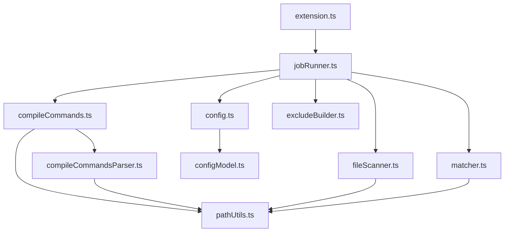

# 模块说明

本文档按源码文件说明各模块职责，便于后续维护或扩展功能。

## `src/extension.ts`

扩展入口模块。

职责：

- 激活扩展
- 注册 `vsExclude.generate`
- 注册 `vsExclude.showLog`
- 管理任务执行器生命周期

它本身不承担扫描、解析和写配置逻辑，只做命令装配。

## `src/jobRunner.ts`

后台任务执行模块。

职责：

- 创建 Output Channel
- 保证生成任务串行执行
- 捕获错误并显示通知
- 记录整次运行的关键日志与阶段样本

这是命令入口和核心算法之间的胶水层。

## `src/config.ts`

VS Code 配置读取模块。

职责：

- 从工作区设置获取配置
- 兼容对象式配置与旧拆分配置
- 输出统一的内部配置对象

## `src/configModel.ts`

配置模型与归一化模块。

职责：

- 定义 `ExtensionConfig`
- 清洗字符串数组
- 处理可选字符串
- 合并不同来源的配置

这个模块不依赖 VS Code API，适合单元测试。

## `src/compileCommands.ts`

`compile_commands.json` 加载模块。

职责：

- 解析配置路径
- 检测文件是否存在
- 读取文件内容
- 把内容交给纯解析模块处理

它负责“定位与读取”，不负责解析细节。

## `src/compileCommandsParser.ts`

`compile_commands` 纯解析模块。

职责：

- 解析 JSON 数组
- 兼容 `command` 与 `arguments`
- 提取源文件路径
- 提取 include 搜索目录
- 过滤工作区外路径

这是算法中最适合做独立测试的纯函数模块之一。

## `src/fileScanner.ts`

工作区文件扫描模块。

职责：

- 递归读取目录
- 只保留普通文件
- 输出统一的相对路径列表

它为匹配与折叠逻辑提供完整输入集合。

## `src/matcher.ts`

可见性匹配模块。

职责：

- 处理 `include`
- 处理 `exclude`
- 合并编译源文件
- 合并头文件目录规则
- 输出 `keptFiles` 与 `hiddenFiles`

这是“保留哪些文件”决策的核心模块。

## `src/excludeBuilder.ts`

`files.exclude` 生成模块。

职责：

- 构建目录树
- 判断目录是否整棵子树隐藏
- 优先输出目录级规则
- 对混合目录保留文件级规则

这个模块负责把隐藏集合压缩成更适合 VS Code 使用的配置结构。

## `src/pathUtils.ts`

路径工具模块。

职责：

- 统一路径分隔符
- 规范化相对路径
- 解析配置路径
- 把绝对路径转换为工作区相对路径
- 判断文件是否位于某个目录下

它是多个模块共享的底层工具。

## 依赖关系概览

